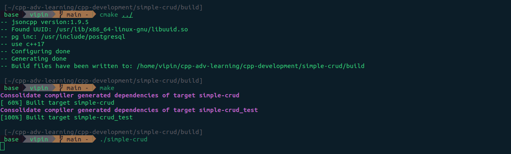
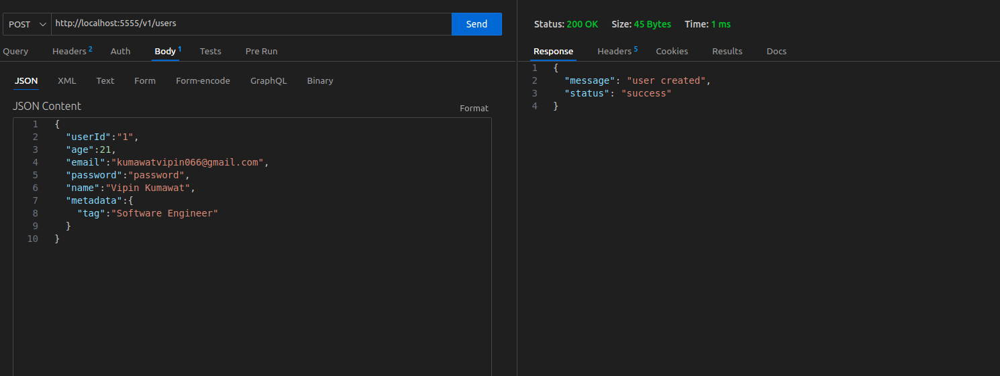
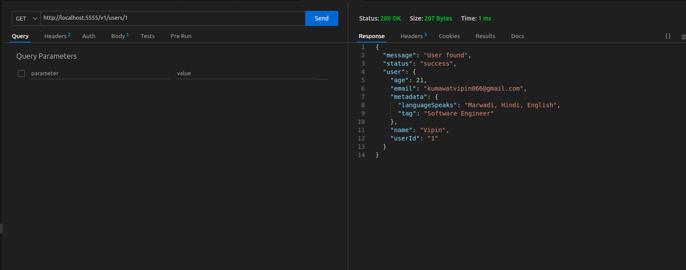
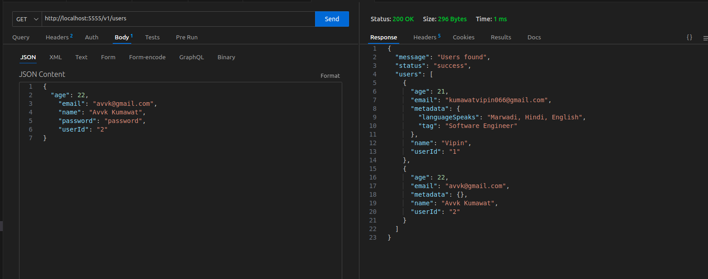
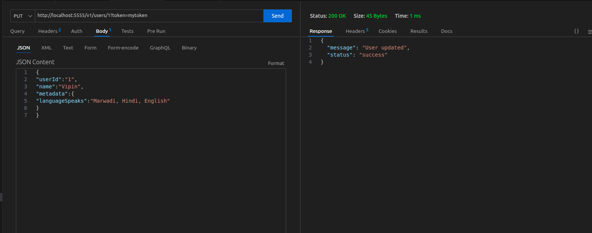
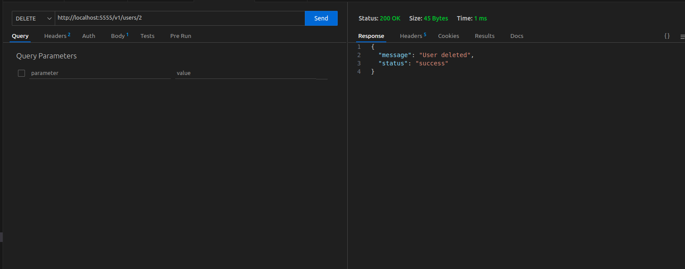

### Project Setup

```bash
drogon_ctl create project simple-crud
cd simple-crud
```

#### Create Controller

```bash
cd controllers
drogon_ctl create controller -h V1::Users
```

### Run Project

Move to `build` dir

```bash
cd build
```

Run cmake command

```bash
cmake ../
```

Run make command

```bash
make
```

It will give you an executable

```bash
./simple-crud
```

Move to port:`5555`

```bash
http://localhost:5555/v1/users
```



<br/>

#### Create User

- URL: http://localhost:5555/v1/users
- Method: `POST`
- Body :

```json
{
  "userId": "1",
  "age": 21,
  "email": "kumawatvipin066@gmail.com",
  "password": "password",
  "name": "Vipin Kumawat",
  "metadata": {
    "tag": "Software Engineer"
  }
}
```

- Response:

```json
{
  "message": "user created",
  "status": "success"
}
```



<br/>

#### Get User

- URL: http://localhost:5555/v1/users/1
- Method: `GET`
- Path Parameter: `userId`
- Response:

```json
{
  "message": "User found",
  "status": "success",
  "user": {
    "age": 21,
    "email": "kumawatvipin066@gmail.com",
    "metadata": {
      "languageSpeaks": "Marwadi, Hindi, English",
      "tag": "Software Engineer"
    },
    "name": "Vipin",
    "userId": "1"
  }
}
```



<br/>

#### Get All User

- URL: http://localhost:5555/v1/users
- Method: `GET`
- Response:

```json
{
  "message": "Users found",
  "status": "success",
  "users": [
    {
      "age": 21,
      "email": "kumawatvipin066@gmail.com",
      "metadata": {
        "languageSpeaks": "Marwadi, Hindi, English",
        "tag": "Software Engineer"
      },
      "name": "Vipin",
      "userId": "1"
    },
    {
      "age": 22,
      "email": "avvk@gmail.com",
      "metadata": {},
      "name": "Avvk Kumawat",
      "userId": "2"
    }
  ]
}
```



<br/>

#### Update User

- URL: http://localhost:5555/v1/users/1?token=mytoken
- Method: `PUT`
- Path Parameter: `userId`
- Query Parameter: `token`
- Response:

```json
{
  "message": "User updated",
  "status": "success"
}
```



<br/>

#### Delete User

- URL: http://localhost:5555/v1/users/1
- Method: `Delete`
- Path Parameter: `userId`
- Response:

```json
{
  "message": "User deleted",
  "status": "success"
}
```


